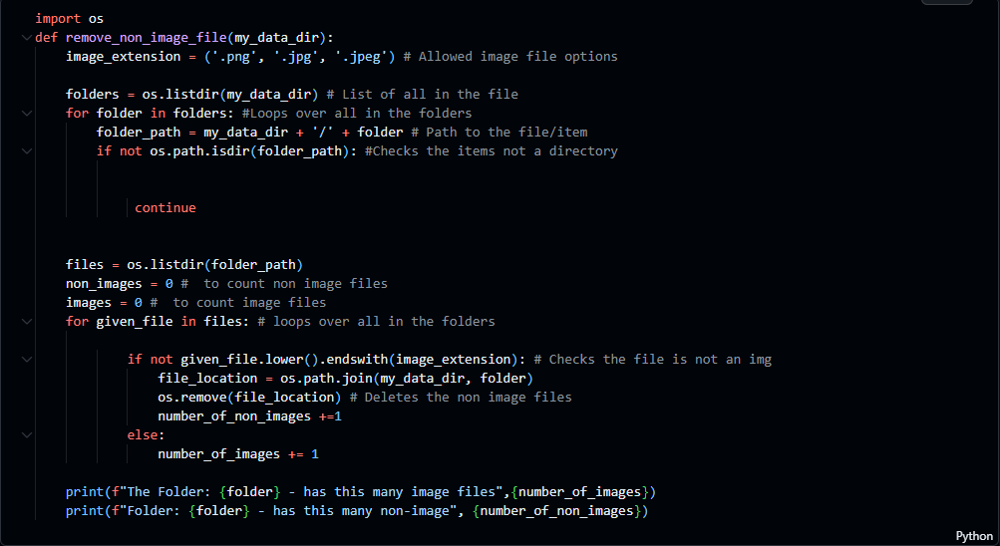
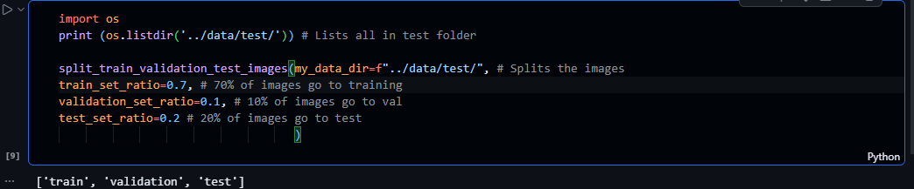

# Project Title: Xray Fracture Classification

## Introduction 

This project uses a machine learning pipeline to to catergorise fracture images from Xrays. This project uses a CNN (convulutional neural network), and trains it to catergorise the bone xrays into fractured and non fractured using a kaggle Xray Fracture classification database. The xray database is saved and split into three catergories; train (training), val (validation) and test (testing). This project produced then trained and produced two CNN models for comparison and evaluation and compared there outputs suggesting future changes, limitations and issues arrised. 

## Business Objectives

The purpose of this project is to produces two CNN for fracture classification from Xray Images with an accuracy over 70%, this can be used in clinical settings to help with processing xray images of fractures and help in faster detection and therefor treatment. This project aims to catergorise the fractures into two catergories, fractured and non fractured with over 70% accuracy while minimising errors. 

# ML Pipeline 

This ML Pipeline is the workflow of the project that shows the building and training and testing of the CNN model, below are the stages of the pipeline:

## 1. Data Collection 

The dataset used in this project is Bone Fracture Binary Classification from kaggle. The first stage for the dataprocessing is the removal of any non-images or invalid image formats, this is done bytusing the code below 

This uses a list of accepted image extentions and removes and deletes the non-images then counting the amount of valid and the non-images. This prevents the program not working due to invalid files. 

The dataset is then split into three catergories, train ,test and val. This isnt nessesarily requried as the selected database is alrady split so this is a verification. The data is split at the ratio of 70% to train, 20% to validation and 10% to testing.

## 2. EDA 

An EDA (Exploratory data analysis) has been conducted in the data visulisation notebook, this has been conducted to 

## 3. Model Building 

## 4. Model Evaluation 

## 5. Prediction 

## Jupyter Notebook Structure 

## Future Work 

## Libraries and Modules 

TensorFlow / Keras

Numpy

Pandas

Matplotlib

Seaborn

Scikit Learn

Joblib

OS

PIL 

## Unfixed Bugs 

Some of the images from the database are corrupted, leading to them only being able to be partialy used. 

The CNN are trained only on the CPU increasing the training time and slowing progress.

## Acknowledgements and References

## Conclusions 